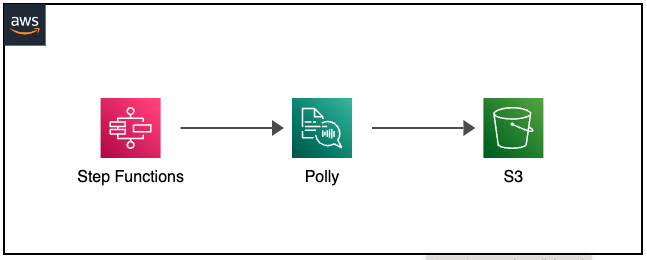

# AWS Step Function to Amazon Polly to S3 with CDK



## Deploy the stack

```bash
yarn deploy
```

## Test the stack

After the stack is deployed, you can test it by start a execution of the state machine.

```json
[
  {
    "word": "Hello"
  },
  {
    "word": "World"
  }
]
```

After the execution is completed, you can check the S3 bucket for the mp3 files.

## Clean up

Don't forget to clean up after you are done. This will remove all resources created by the stack.

```bash
yarn destroy
```
