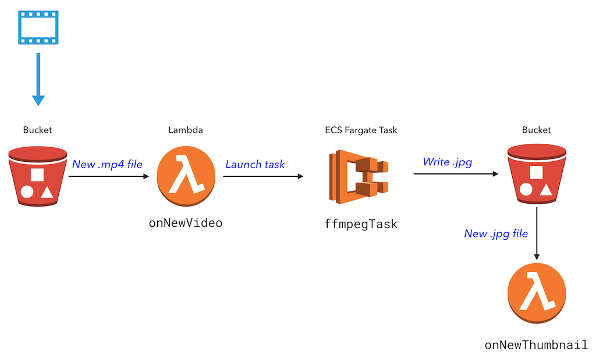

# Video Thumbnailer with AWS Lambda and Fargate using AWS CDK

We’ll build an application that extracts a thumbnail from a video using AWS Lambda and Fargate. The application will be able to process multiple videos in parallel and store the thumbnails in S3.

## Architecture



We’ll use the following AWS services:

- Lambda
- Fargate
- S3

## Prerequisites

- AWS account
- [AWS CLI](https://docs.aws.amazon.com/cli/latest/userguide/cli-chap-install.html)
- [AWS CDK](https://docs.aws.amazon.com/cdk/latest/guide/getting_started.html)
- [Docker](https://docs.docker.com/get-docker/)

## Create and deploy the project

### Create the project

- Make sure [Docker](https://docs.docker.com/get-docker/) is installed and running.
- Create a new directory and initialize a CDK project:

```bash
mkdir video-thumbnailer
cd video-thumbnailer
cdk init app --language typescript
```

### Cloud infrastructure

- Replace the contents of `lib/video-thumbnailer-stack.ts` with the following:

```typescript
// A simple cluster to run our tasks in. We will import default VPC and use default cluster.
// You can also create your own VPC and/or cluster.
const cluster = new ecs.Cluster(this, 'Cluster', {
  vpc: ec2.Vpc.fromLookup(this, 'VPC', { isDefault: true })
});

// A bucket to store videos and thumbnails.
const bucket = new s3.Bucket(this, 'Bucket', {
  // following settings for demo purposes only. DON'T USE IN PRODUCTION!
  removalPolicy: cdk.RemovalPolicy.DESTROY,
  autoDeleteObjects: true
});

// a task role that allows the task to access the bucket
const taskRole = new iam.Role(this, 'TaskRole', {
  assumedBy: new iam.ServicePrincipal('ecs-tasks.amazonaws.com'),
  description: 'Allows the task to access the bucket'
});
bucket.grantReadWrite(taskRole);

// A task definition that will run FFMPEG on Fargate
const taskDefinition = new ecs.FargateTaskDefinition(this, 'TaskDef', {
  memoryLimitMiB: 512,
  cpu: 256,
  taskRole: taskRole,
  family: 'video-thumbnailer'
});

// Add FFMPEG container to the task definition
const ffmpegContainer = taskDefinition.addContainer('ffmpeg', {
  image: ecs.ContainerImage.fromAsset(
    path.join(__dirname, './worker-docker-ffmpeg-thumb'),
    {
      file: 'Dockerfile',
      // because jrottenberg/ffmpeg doesn't support ARM64, we need to use X86_64
      platform: assets.Platform.LINUX_AMD64 // <--- this is the important part
    }
  ),
  logging: new ecs.AwsLogDriver({
    streamPrefix: 'ffmpeg',
    logRetention: logs.RetentionDays.ONE_WEEK
  })
});

// === lambda ===
// A lambda function that will be triggered by S3 object creation event
const onNewVideoFn = new NodejsFunction(this, 'OnNewVideoLambda', {
  runtime: lambda.Runtime.NODEJS_18_X,
  entry: path.join(__dirname, './lambda/index.ts'),
  handler: 'onNewVideoHandler',
  architecture: lambda.Architecture.ARM_64,
  description: 'A lambda function that triggers on new video upload',
  environment: {
    FARGATE_TASK_DEFINITION: taskDefinition.taskDefinitionArn,
    FARGATE_CONTAINER_NAME: ffmpegContainer.containerName,
    FARGATE_CLUSTER: cluster.clusterName,
    FARGATE_SUBNET_IDS: cluster.vpc.publicSubnets
      .map((s) => s.subnetId)
      .join(',')
  }
});
// set permissions to allow lambda to run the task
taskDefinition.grantRun(onNewVideoFn);

// trigger lambda on new video upload
bucket.addEventNotification(
  s3.EventType.OBJECT_CREATED,
  new s3n.LambdaDestination(onNewVideoFn),
  { suffix: '.mp4' }
);

// a lambda function triggers on new thumbnail created and uploaded to the bucket
const onNewThumbnailFn = new NodejsFunction(this, 'OnNewThumbnailLambda', {
  runtime: lambda.Runtime.NODEJS_18_X,
  entry: path.join(__dirname, './lambda/index.ts'),
  handler: 'onNewThumbnailHandler',
  architecture: lambda.Architecture.ARM_64,
  description: 'A lambda function that triggers on new thumbnail upload'
});

// allow lambda to read from the bucket
bucket.grantRead(onNewThumbnailFn);

// trigger lambda on new thumbnail upload
bucket.addEventNotification(
  s3.EventType.OBJECT_CREATED,
  new s3n.LambdaDestination(onNewThumbnailFn),
  {
    suffix: '.jpg'
  }
);
```

The code above creates `a cluster`, `a bucket`, `a task definition`, and `two lambda functions`. The lambda functions will be triggered by S3 events. The first lambda function will run a task on Fargate. The second lambda function will be triggered when the task finishes and a thumbnail is uploaded to the bucket.

### Fargate worker

- Create a new directory `worker-docker-ffmpeg-thumb` and add the following files:

```bash
mkdir worker-docker-ffmpeg-thumb
touch worker-docker-ffmpeg-thumb/Dockerfile
touch worker-docker-ffmpeg-thumb/ffmpeg-thumb.sh

# add the following code to worker-docker-ffmpeg-thumb/Dockerfile
```

```dockerfile
FROM jrottenberg/ffmpeg

RUN apt-get update --yes && \
    apt-get install curl unzip --yes && \
    apt-get clean --yes

# Install AWS v2 cli
RUN curl "https://awscli.amazonaws.com/awscli-exe-linux-x86_64.zip" -o "awscliv2.zip" && \
    unzip awscliv2.zip && \
    ./aws/install && \
    rm -rf aws

WORKDIR /tmp/workdir

# Copy entrypoint.sh to workdir
COPY entrypoint.sh entrypoint.sh

# make entrypoint.sh executable by default
RUN chmod +x entrypoint.sh

ENTRYPOINT ["./entrypoint.sh"]
```

```bash
# add the following code to worker-docker-ffmpeg-thumb/entrypoint.sh
```

```bash
#!/bin/bash

# test aws cli installation
echo "Testing aws cli installation..."
aws --version

echo "Starting ffmpeg task..." && \
echo "Copying video from s3://${S3_BUCKET}/${INPUT_VIDEO} to ${INPUT_VIDEO}..." && \
aws s3 cp s3://${S3_BUCKET}/${INPUT_VIDEO} ./${INPUT_VIDEO} && \

# get time duration of the video. it will be used to calculate the time offset
# echo "Getting video duration..." && \
# DURATION=$(ffprobe -v error -show_entries format=duration -of default=noprint_wrappers=1:nokey=1 ./${INPUT_VIDEO}) && \

# run ffmpeg
ffmpeg -v error -i ./${INPUT_VIDEO} -ss ${TIME_OFFSET} -vframes 1 -f image2 -an -y ${OUTPUT_FILE} && \
echo "Copying thumbnail to S3://${S3_BUCKET}/${OUTPUT_FILE} ..." && \
aws s3 cp ./${OUTPUT_FILE} s3://${S3_BUCKET}/${OUTPUT_FILE}

```

This Dockerfile uses the `jrottenberg/ffmpeg` image as the base image. It installs the AWS CLI and copies the `entrypoint.sh` script to the container. The `entrypoint.sh` script will be executed when the container starts. It will download the video file from S3, run the FFMPEG command, and upload the thumbnail to S3.

### Lambda code

- Create a new directory `lambda` and add the following files:

```bash
mkdir lambda
touch lambda/index.ts

# add the following code to lambda/index.ts
```

```typescript
/**
 * handle new video event when a new video is uploaded to the bucket
 * @param event
 */
export const onNewVideoHandler = async (event: S3Event) => {
  console.log('onNewVideoHandler', event);
  // When a new video is uploaded, run the FFMPEG task on the video file.
  // Use the time index specified in the filename (e.g. cat_00-01.mp4 uses timestamp 00:01)
  if (!event.Records || event.Records.length === 0) {
    console.log('*** New video: no records found.');
    return;
  }

  console.log('environment variables', {
    FARGATE_CLUSTER,
    FARGATE_TASK_DEFINITION,
    FARGATE_CONTAINER_NAME,
    FARGATE_SUBNET_IDS
  });

  // loop through all the records
  for (const record of event.Records) {
    console.log(
      `*** New video: file ${record.s3.object.key} was uploaded at ${record.eventTime}.`
    );

    const file = record.s3.object.key;
    const bucket = record.s3.bucket.name;
    const thumbnailFile = file.substring(0, file.indexOf('_')) + '.jpg';

    // we need to upload video with the name of cat_00-01.mp4
    // if the file name is cat_00-01.mp4, then framePos is 00:01
    let framePos = file
      .substring(file.indexOf('_') + 1, file.indexOf('.'))
      .replace('-', ':');

    // if framePos is not a valid time index, set it to 00:00
    if (!framePos.match(/\d\d:\d\d/)) {
      framePos = '00:00';
    }

    console.log(
      `*** New video: thumbnail file ${thumbnailFile} at ${framePos}.`
    );

    // run ffmpegThumbnailTask on the video file
    const task = new FargateTask({
      taskDefinition: FARGATE_TASK_DEFINITION,
      cluster: FARGATE_CLUSTER,
      networkConfiguration: {
        awsvpcConfiguration: {
          subnets: FARGATE_SUBNET_IDS.split(','),
          assignPublicIp: 'ENABLED'
        }
      }
    });

    await task.run({
      overrides: {
        containerOverrides: [
          {
            name: FARGATE_CONTAINER_NAME,
            environment: [
              {
                name: 'S3_BUCKET',
                value: bucket
              },
              {
                name: 'INPUT_VIDEO',
                value: file
              },
              {
                name: 'TIME_OFFSET',
                value: framePos
              },
              {
                name: 'OUTPUT_FILE',
                value: thumbnailFile
              }
            ]
          }
        ]
      }
    });

    console.log(`*** New video: thumbnail task started for ${file}.`);
  }

  return {
    statusCode: 200
  };
};

/**
 * handle new thumbnail event when a new thumbnail created for a video and uploaded to the bucket
 * @param event
 */
export const onNewThumbnailHandler = async (event: S3Event) => {
  // When a new thumbnail is created, log a message.
  console.log('onNewThumbnailHandler', event);

  // loop through all the records
  for (const record of event.Records) {
    console.log(
      `*** New thumbnail: file ${record.s3.object.key} was uploaded at ${record.eventTime}.`
    );
  }

  return {
    statusCode: 200
  };
};
```

- The Lambda function `onNewVideoHandler` is triggered whenever a new .mp4 video file is uploaded to the S3 bucket. The Lambda extracts the time index that is encoded in the video filename (in the form file_mm-ss) and launches the container task.

- The Lambda function `onNewThumbnailHandler` is triggered when a new .jpg thumbnail file is uploaded to the S3 bucket, and prints a message to the log file.

## Deploy the application

Preview and deploy changes via `cdk up`, which will take a few minutes.

```bash
cdk deploy
```

## Test the application

- Download a sample video file from [Sample](./images/big_buck_bunny_00-01.mp4) and upload it to the S3 bucket.

```bash
aws s3 cp ./images/big_buck_bunny_00-01.mp4 s3://<your-bucket-name>/big_buck_bunny_00-01.mp4
```

- Check the CloudWatch log for the Lambda function `onNewVideoHandler` and `onNewThumbnailHandler`.

```bash
# check the log for the Lambda function onNewVideoHandler
aws logs tail /aws/lambda/ffmpeg-thumbnailer-stack-onNewVideoHandler --follow

# check the log for the Lambda function onNewThumbnailHandler
aws logs tail /aws/lambda/ffmpeg-thumbnailer-stack-onNewThumbnailHandler --follow
```

After a few minutes, you should see new thumbnails `big_buck_bunny.jpg` in the S3 bucket.

## Clean up

That's it! To clean up the resources created by this example, run the following command:

```bash
cdk destroy
```

